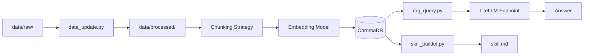

# Build Your Personal RAG: U.S. Big Tech Earnings and Investor Communications

## 1. 專案簡介

本專案建立一個以**美股大型科技公司財報、法說會逐字稿、新聞稿與投資人關係文件**為核心的輕量化 RAG 系統。知識庫主要涵蓋以下公司：

- Alphabet
- Amazon
- Apple
- Meta
- Microsoft
- NVIDIA

此知識庫聚焦於這些公司在公開投資人關係文件中呈現的財務表現、業務策略、AI 投資方向、資本支出、雲端與廣告業務發展，以及管理層對未來趨勢的敘事。

我選擇這個主題的原因如下：

1. **知識邊界明確**：相較於過於寬泛的「美股投資」或「科技新聞」，本專案聚焦在大型科技公司公開發布的投資人關係文件，範圍較清楚。
2. **資料可持續更新**：每季都會有新的 earnings release、earnings call transcript、shareholder letter 與公告，適合持續擴充。
3. **文件資訊密度高**：財報與法說會文件包含大量可檢索的資訊，例如成長動能、風險、管理層觀點、資本配置、AI 與雲端策略等，適合測試 RAG 系統的檢索與整合能力。
4. **對實際應用有價值**：最終產出的 skill.md 不只是作業成果，也可以作為後續做公司比較、財報閱讀輔助或投資研究問答時的知識底稿。

### 資料來源類型與規模

本專案資料主要來自各公司公開的投資人關係（Investor Relations）相關文件，包含：

- Earnings Release / Press Release
- Earnings Call Transcript / Call 文件
- Shareholder Letter
- Financial Statements / Exhibit 類型文件
- Next Earnings Date / Financial Results Date 公告頁

目前資料總數為 **20 份原始文件**，原始格式以 **PDF 與 TXT** 為主，並透過 `data_update.py` 清理後輸出至 `data/processed/` 中的 TXT 檔案，以支援後續 chunking、embedding 與重建。作業要求資料量至少 20 份，且 `data/processed/` 建議一併 commit，這部分本專案皆有納入。:contentReference[oaicite:1]{index=1}

### 系統技術選型

本專案的主要技術選型如下：

- **Embedding Model**：`sentence-transformers/paraphrase-multilingual-MiniLM-L12-v2`
- **Vector DB**：ChromaDB
- **LLM 呼叫方式**：助教提供的 LiteLLM endpoint（使用 OpenAI-compatible client 呼叫）
- **Chunking**：固定長度切分 + overlap
- **開發環境**：Python 3.13.12

---

## 2. 系統架構說明（含 Mermaid 圖）

本專案分成三個主要元件：

- data_update.py

負責讀取 data/raw/ 中的原始檔案，進行文字清理、輸出 data/processed/、切分 chunks、做 embedding，並將向量與 metadata 寫入 ChromaDB。這是整個 RAG 系統的地基，也是作業的技術核心。

- rag_query.py

提供 CLI 問答介面。系統會將使用者問題向量化、從向量資料庫取回最相關的 chunks，組合 prompt 後交給 LLM 生成回答，並顯示引用來源。這對應作業要求的 RAG 流程：Embed Query → Retrieve Chunks → LLM Generate。

- skill_builder.py

不是回答單一問題，而是透過一組預先設計的全域問題，系統性掃描知識庫，最後自動生成 skill.md。這對應作業要求中「從問答提升到 Skill 層級」的部分。
## 3. 設計決策說明（Design Decisions）
### 3.1 Chunking 策略
本專案採用固定長度 + overlap 的 chunking 策略。實作上以大約 800 字元為一個 chunk，並保留約 120 字元 overlap。

採用這個策略的原因如下：

財報逐字稿、新聞稿、公告頁與財務附件的格式差異很大，若以段落邊界切分，實際上並不穩定。
固定長度切分較容易實作與除錯，也較不容易因 PDF 轉文字後的排版問題而切得太碎。
overlap 能降低重要敘述被硬切斷後語意中斷的問題。
在本作業規模下，這種方法足以支撐有效的 retrieval，同時保持可重現性。

我沒有在第一版就加入語意切分或更進階的 chunking，主要是為了先完成完整 RAG pipeline，再做穩定的改進。
### 3.2 Embedding 模型選擇
本專案選用 sentence-transformers 的本地模型：
paraphrase-multilingual-MiniLM-L12-v2
原因如下：
作業明確推薦此模型作為中英混合資料的免費方案。
我的文件主要是英文，但操作、提問與 README / skill.md 偏中文，因此 multilingual 模型比純英文模型更合適。
使用本地 embedding 模型可避免外部 API 成本，也不需要額外的 embedding key。
對目前 20 份文件的規模來說，384 維向量足以應付檢索需求。

### 3.3 Vector DB 選型
本專案選擇 ChromaDB，而不是 pgvector。

原因如下：

- ChromaDB 為純 Python，本地即可執行，不需額外 Docker 或資料庫服務。
- 在本專案文件量與 chunk 數量的規模下，ChromaDB 已足夠。
- 相較於 pgvector，ChromaDB 更適合先完成 prototype，降低環境設定與除錯成本。
- 作業規格明確接受 ChromaDB 作為合法選項。

雖然作業推薦 pgvector，原因是它更接近真實 production 環境、也更適合 metadata filtering，但我在本次作業中優先考慮的是快速完成一個可穩定重現的本地端 RAG 系統。
### 3.4 Retrieval 策略
本專案採用基本的 cosine similarity search。預設：

- rag_query.py：top-k = 5
- skill_builder.py：top-k = 8

這樣設計的原因是：

- top-k 太小時，容易只抓到局部 chunks，導致回答過度偏向某一家公司或高頻主題。
- top-k 太大時，context 過長，反而會降低回答焦點。
- 單題問答時 top-k=5 已足夠產生簡潔回答；整體總結時則略提高至 top-k=8，以讓模型看到更廣的資訊範圍。
目前未加入 reranking，主要是希望先將基礎流程做穩；未來若要提高回答品質，可以加入 reranker 或 metadata-aware retrieval。
### 3.5 Prompt Engineering
在 rag_query.py 中，我的 prompt 設計原則是：

- 明確要求模型只能根據提供的 context 回答
- 若 context 不足，需誠實說明
- 要求以繁體中文輸出
- 回答後附上最相關的來源檔案與 chunk index

在 skill_builder.py 中，我則設計了一組「全域問題」，例如：

- 這個知識庫的核心主題是什麼？
- 最重要的核心概念有哪些？
- 主要趨勢有哪些？
- 重要實體有哪些？
- 方法論與最佳實踐為何？
- 知識邊界與限制為何？
- 代表性問答有哪些？

此外，我也加入了 metadata hint（例如已知公司與文件類型），避免模型因只看到局部 context，而誤把某個高頻子主題（例如 AI）當成整個知識庫的唯一主題。
### 3.6 Idempotency 設計
data_update.py 支援 --rebuild，執行時會：

- 清空 data/processed/
- 重建 Chroma collection
- 重新處理 data/raw/ 中所有支援格式檔案
- 重新輸出 processed TXT
- 重新建立 chunks 與向量索引

這樣可保證每次 --rebuild 後，向量資料庫的內容都完整反映目前的 data/ 狀態，而不會重複累積舊資料。這也符合作業對 idempotent 執行的要求。

此外，我也為原始檔案計算 SHA256 hash 並存入 metadata，作為未來做增量更新的基礎。不過目前完整驗證的主流程仍以 --rebuild 為主。
### 3.7 skill_builder.py 的問題設計
skill_builder.py 的設計重點不是一般問答，而是讓系統從不同角度掃描整個知識庫。我設計的問題類型包括：

- 主題總覽
- 核心概念
- 趨勢
- 關鍵實體
- 方法論與最佳實踐
- 知識邊界
- 代表性問答

這樣的設計目的是讓 skill.md 不只是簡單摘要，而是更接近一份可以被 Agent 直接使用的知識技能文件。

## 4. 環境設定與執行方式
### 4.1 Python 版本與虛擬環境
本專案使用的 Python 版本為：Python 3.13.12
建立與啟動虛擬環境如下：
1. Windows PowerShell
python --version
python -m venv .venv
Set-ExecutionPolicy -Scope Process -ExecutionPolicy Bypass
.venv\Scripts\Activate.ps1
pip install -r requirements.txt
2. Linux / macOS
python3 --version
python3 -m venv .venv
source .venv/bin/activate
pip install -r requirements.txt
### 4.2 Vector DB 啟動說明

本專案使用 ChromaDB，不需要額外 server，因此：

- 無需 docker-compose.yml
- 無需額外啟動 PostgreSQL / pgvector
- 無需額外執行 docker compose up -d

ChromaDB 的持久化路徑設定於 .env 中：
CHROMA_PERSIST_DIR=./chroma_db
### 4.3 完整執行流程
以下以 Windows PowerShell 為例：

1.確認 Python 版本python --version

2.建立並啟動虛擬環境
python -m venv .venv
Set-ExecutionPolicy -Scope Process -ExecutionPolicy Bypass
.venv\Scripts\Activate.ps1

3.安裝套件
pip install -r requirements.txt

4.設定環境變數
copy .env.example .env

將 .env 中的 LITELLM_API_KEY 與 LITELLM_BASE_URL
填入助教提供的值

5.本專案使用 ChromaDB，無需 docker compose

6.全量重建索引
python data_update.py --rebuild

7.測試 RAG 問答
python rag_query.py --query "請問這個知識庫的核心主題是什麼？"

8.生成 Skill 文件
python skill_builder.py --output skill.md
## 5. 資料來源聲明（Data Sources Statement）
本專案使用的資料皆來自各公司公開可取得的投資人關係文件與公告頁，屬於合法可取得之公開資訊。
| 來源名稱                               | 類型        | 授權 / 合規依據 | 數量 |
| ---------------------------------- | --------- | --------- | -- |
| Alphabet Investor Relations files  | PDF / TXT | 公開投資人關係文件 | 3  |
| Amazon Investor Relations files    | PDF       | 公開投資人關係文件 | 2  |
| Apple Investor Relations files     | PDF / TXT | 公開投資人關係文件 | 3  |
| Meta Investor Relations files      | PDF / TXT | 公開投資人關係文件 | 4  |
| Microsoft Investor Relations files | PDF / TXT | 公開投資人關係文件 | 4  |
| NVIDIA Investor Relations files    | PDF / TXT | 公開投資人關係文件 | 4  |
總計：20 份文件。
## 6. 系統限制與未來改進
目前系統的限制如下：

1. **Retrieval 仍為基本 similarity search**
尚未加入 reranking，因此有時會偏向高頻主題，例如 AI，而未完整反映整個知識庫全貌。
2. **PDF 清理品質有限**
部分 PDF 轉文字後，表格、排版與段落結構會流失，影響 chunk 品質。
3. **Metadata 部分依賴檔名推斷**
若原始檔名不夠一致，可能造成公司或文件類型辨識不穩。
4.**skill_builder.py 雖已自動生成 skill.md，但仍可能受局部 context 影響**
因此目前仍需要少量人工潤飾，以提升整體一致性。
5.**尚未完成完整增量更新**
雖然已有 hash metadata 作為基礎，但目前主要穩定流程仍是 --rebuild。

若有更多時間，我會進一步做以下改進：

- 加入 reranking 或 metadata-aware retrieval
- 改善 PDF 清理與段落切分策略
- 將原始檔名規則進一步標準化
- 加強 skill_builder.py 的 prompt 設計，降低 summary 偏題問題
- 評估升級為 pgvector，以支援更靈活的 metadata filtering

---

